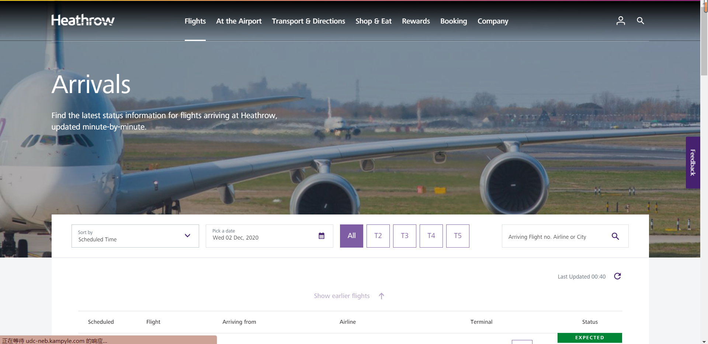
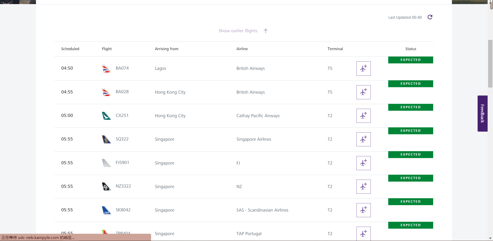
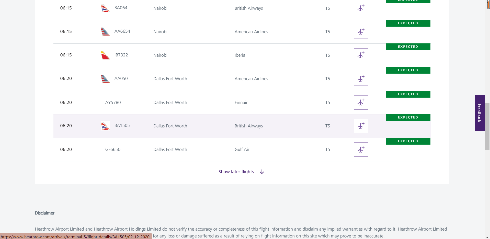
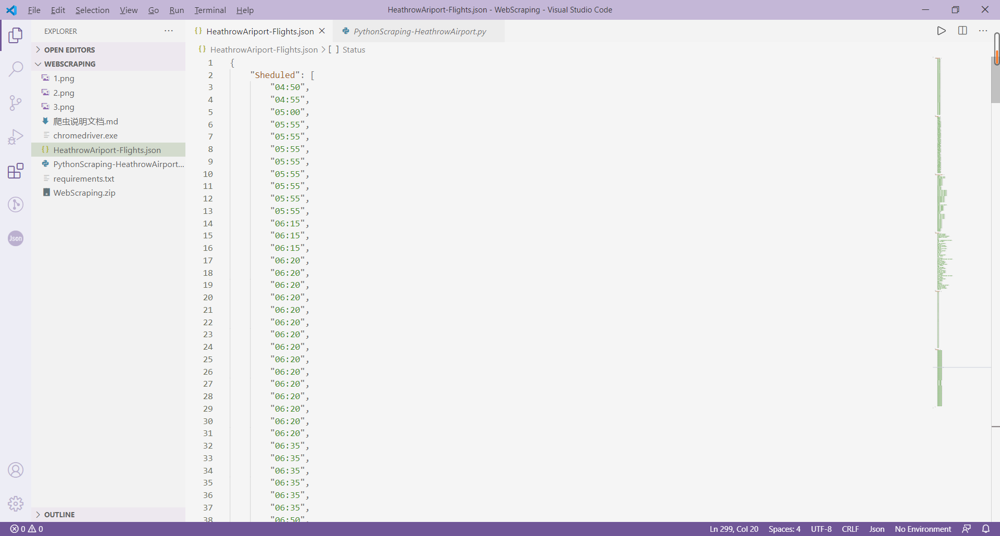
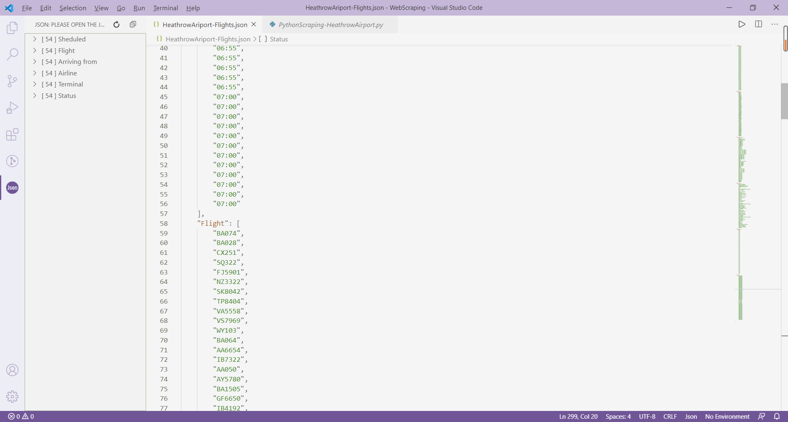
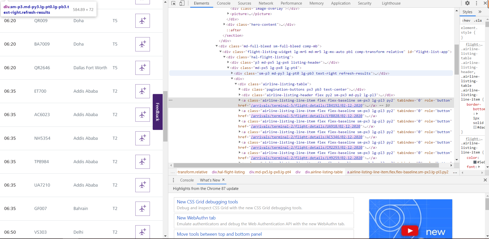

# 爬虫说明文档

> By 18373059 胡鹏飞

### 爬虫使用说明

```
本爬虫项目旨在爬虫英国希思罗机场的到达航班的航班信息，其航班信息包括航班应该到达的时间，航班编号，出发地点，航班所在公司，达到的航站楼和航班状态信息。爬取的网站的网址为
```

[Arrivals|Heathrow](https://www.heathrow.com/arrivals)，爬虫爬取的结果存储在项目根目录下的 HeathrowAriport-Flights.json 文件中。

航班主页截图：



航班详情页面截图：





### 数据介绍和爬取结果

我们将获取出来的数据放入Python内置的字典当中，字典一共有6个key值对应6个list，每一个list分别对应每一条航班的航班信息。在讲页面中的数据信息爬取下来之后，返回一个长度为18(一个页面有18条航班信息)的list，将list中的text按照换行符拆分，再用另外一个list获取到分割后的数据，将list中的数据按照顺序放入字典中即可。以下时json文件截图：





该Json文件获取了当时最新的航班信息。

### 爬虫编写步骤

1. 首先明确目标网站的网站类型，如果时静态网站可以使用scrape框架设置url和Rule进行简单的爬取即可，如果时动态网站需要使用selenium库并搭配含有Headless的浏览器进行模拟用户请求对网站进行爬取。在本次爬取的网站中是动态网站，即数据不直接存储在源代码当中，而是需要通过js文件去请求才能得到。
2. 初始化chromedriver，获取目标网站。

```python
# 爬取的页数
Pages_num = 3
# 间隔时间
Intervel_time = 600
# 添加文件输出路径，会覆盖文件之中已有的数据！
f1 = open("HeathrowAriport-Flights.json", "w+")

# 设置ChromeDriver
chrome_options = Options()
chrome_options.add_argument("--headless")

# 初始化Driver
driver = webdriver.Chrome(
    executable_path='chromedriver', 
    options=chrome_options)
driver.get('https://www.heathrow.com/arrivals')

# Drvier get到网站之后需要重新设置window_size, 否则数据确实一部分
driver.set_window_size(300, 1000)
#driver.maximize_window()

# 设置Json数据的字典，便于输出
JsonData = {"Sheduled" : [], "Flight" :[], "Arriving from": [], "Airline" :[], "Terminal": [], "Status" : []}
```

3. 在浏览器中对网站结构进行分析，探查到航班信息具体在哪个div/table当中：

   
4. 获取目标网站中所有class的名字为airline-listing-line-item的元素。

```python
#获取页面上所有的class名称为airline-listing-line-item的元素
    res = driver.find_elements_by_class_name('airline-listing-line-item')
    time.sleep(1)
```

5. 对已经获得的数据进行分析处理，并检查是否缺少信息。在爬取该网站时，如页面的尺寸较小，则仅仅展示5个数据而不是我们预期的6个数据，这是因为打开页面的尺寸较小，网站自动隐藏了其中一个数据。我们重新设置一下页面即可：

   ```python
   # Drvier get到网站之后需要重新设置window_size, 否则数据确实一部分
   driver.set_window_size(300, 1000)
   ```
6. 将数据进行如前文所述的处理并放在已经建立好的字典当中。

```python
if(len(res) == 0):
        return
    list_element = res[0].text.split('\n')
    #print(list_element)

    # 存储数据
    for e in res:
        list_element = e.text.split('\n')
        JsonData["Sheduled"].append(list_element[0])
        JsonData["Flight"].append(list_element[1])
        JsonData["Arriving from"].append(list_element[2])
        JsonData["Airline"].append(list_element[3])
        JsonData["Terminal"].append(list_element[4])
        JsonData["Status"].append(list_element[5])
```

7. 以上已经将latest的航班获取下来，但是仅仅有18条信息，为了扩充数据集，我们模拟用户对Show later flights按钮进行点击。具体步骤还是如前文所述根据tag_name获取页面上的所有button，并找出我们需要的Show later flights的按钮，模拟用户进行点击即可。

```python
# 获取页面上所有的button信息
    button = driver.find_elements_by_tag_name('button')
    time.sleep(1)

    for e in button:
        #点击按钮翻到下一页
        if(e.text == "Show later flights"):
            # 不能直接使用 e.click()
            driver.execute_script("arguments[0].click();", e)
            time.sleep(1)
```

8. 将字典中的数据输出到目标文件当中，并且设置定时爬取的时间即可。

```python
if __name__ == "__main__":
    while(True):
        for i in range(Pages_num):
            work()
        f1.write(json.dumps(JsonData))
        time.sleep(Intervel_time)
        # 刷新页面，否则爬取的内容还是之前的内容
        driver.refresh()

driver.close()
f1.close()
```

### 注意事项

- 因为网站的服务器所在地为英国，国内访问速度较慢，如果出现了获取数据数量没有达到预期的情况，请重新设置代码中的time.sleep()函数休眠时间参数，如果有科学上网工具也要注意开启全局模式，这里就不将休眠时间设置为全局变量了。
- 在获取到button之后不能直接调用e.click()函数进行点击，具体原因不知为何。
- 因为时调用的time.sleep()函数对进程进行阻塞，所以在退出进程之前无法打开json文件。
- 请在项目的根目录下运行py程序，否则无法找到chromedriver

### 附录

系北航18级软件学院计算机网络大作业

```python
# -*- coding: utf-8 -*-
# @Time    : 12.2
# @Author  : IAmParasite
# @FileName: PythonScraping-HeathrowAirport.py
# @Software: Visual Studio Code

from selenium import webdriver
from selenium.webdriver.chrome.options import Options
import time
import json

# 爬取的页数
Pages_num = 3
# 间隔时间
Intervel_time = 600
# 添加文件输出路径，会覆盖文件之中已有的数据！
f1 = open("HeathrowAriport-Flights.json", "w+")

# 设置ChromeDriver
chrome_options = Options()
chrome_options.add_argument("--headless")

# 初始化Driver
driver = webdriver.Chrome(
    executable_path='chromedriver', 
    options=chrome_options)
driver.get('https://www.heathrow.com/arrivals')

# Drvier get到网站之后需要重新设置window_size, 否则数据确实一部分
driver.set_window_size(300, 1000)
#driver.maximize_window()

# 设置Json数据的字典，便于输出
JsonData = {"Sheduled" : [], "Flight" :[], "Arriving from": [], "Airline" :[], "Terminal": [], "Status" : []}

def work():
    #获取页面上所有的class名称为airline-listing-line-item的元素
    res = driver.find_elements_by_class_name('airline-listing-line-item')
    time.sleep(1)
  
    # 错误检查
    if(len(res) == 0):
        return
    list_element = res[0].text.split('\n')
    #print(list_element)

    # 存储数据
    for e in res:
        list_element = e.text.split('\n')
        JsonData["Sheduled"].append(list_element[0])
        JsonData["Flight"].append(list_element[1])
        JsonData["Arriving from"].append(list_element[2])
        JsonData["Airline"].append(list_element[3])
        JsonData["Terminal"].append(list_element[4])
        JsonData["Status"].append(list_element[5])
    
    # 获取页面上所有的button信息
    button = driver.find_elements_by_tag_name('button')
    time.sleep(1)

    for e in button:
        #点击按钮翻到下一页
        if(e.text == "Show later flights"):
            # 不能直接 e.click()
            driver.execute_script("arguments[0].click();", e)
            time.sleep(1)
  
if __name__ == "__main__":
    while(True):
        for i in range(Pages_num):
            work()
        f1.write(json.dumps(JsonData))
        time.sleep(Intervel_time)
        # 刷新页面，否则爬取的内容还是之前的内容
        driver.refresh()

driver.close()
f1.close()
```
